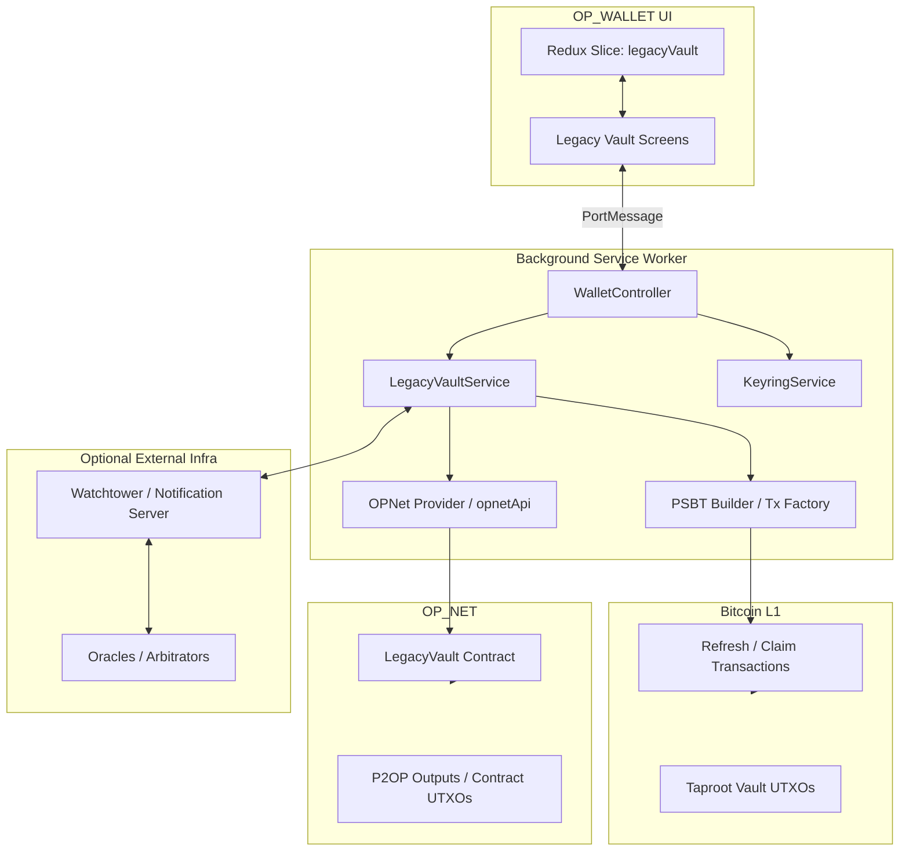
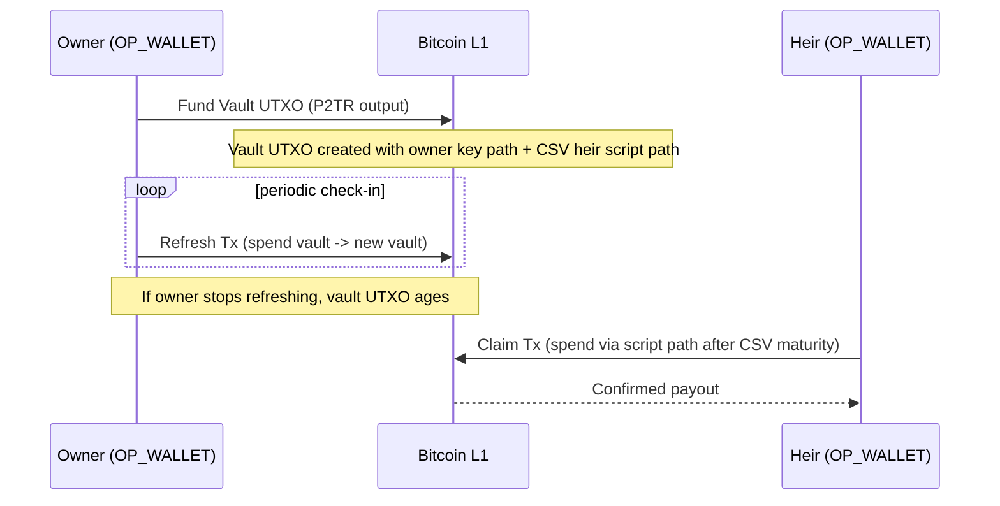
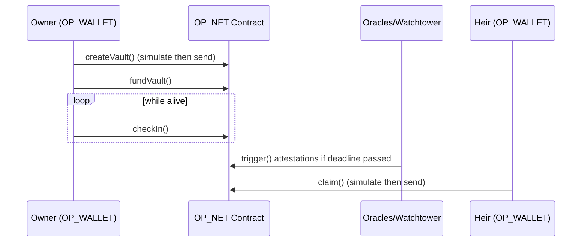
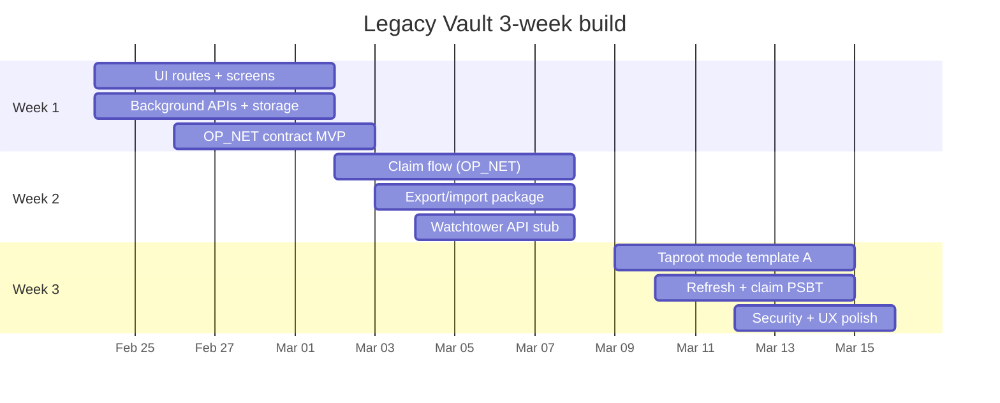

# Bitcoin Layer‑1 Legacy Vault for OP_WALLET

## Executive summary

This report specifies an implementable “Legacy Vault” (Deadman Wallet / crypto inheritance) feature as a first‑class module inside OP_WALLET. The design is shaped by two hard realities:

Bitcoin Layer‑1 cannot “automatically” move coins—someone must ultimately broadcast a valid Bitcoin transaction—and Bitcoin Script (as deployed today) cannot generally enforce a complex “payout schedule to many heirs with percentages” without either (a) splitting funds into multiple independently locked UTXOs, or (b) introducing additional trust assumptions. The protocol therefore must choose between stronger consensus enforcement and richer automation. citeturn34search2turn34search3turn36search0turn39view1

OP_NET adds a powerful execution layer for smart contracts, but OP_NET’s core mechanism uses a SegWit v16 address type (P2OP) that Bitcoin treats as **anyone‑can‑spend**, with access control enforced by off‑chain OP_NET execution and state commitments. That makes OP_NET excellent for high‑feature workflows and composability, but it is not the same threat model as pure Bitcoin Script. citeturn39view0

Accordingly, this specification implements **two custody modes** inside OP_WALLET:

- **Taproot consensus‑enforced vault (Bitcoin‑native mode):** funds sit in one or more Taproot UTXOs whose spending conditions are enforced by Bitcoin Script (Tapscript). Inactivity is enforced via relative timelocks (CSV) and/or absolute timelocks (CLTV). Heirs can claim when timelocks mature; the owner can “check in” by refreshing (spending to a new vault UTXO), which resets relative timelocks. citeturn34search3turn34search2turn36search0turn35search1  
- **OP_NET / P2OP‑managed vault (feature‑rich mode):** vault state, check‑ins, and claim logic live in an OP_NET contract, with Bob‑friendly smart contract development and better UX for arbitration/oracles/incentives. This mode is explicitly **not** Bitcoin consensus‑enforced security because P2OP is anyone‑can‑spend at the base layer. citeturn39view0

The OP_WALLET integration is grounded in the actual extension architecture: a background service worker exposes a `walletController` API invoked by the UI through PortMessage. Routes are enumerated in `src/ui/pages/routeTypes.ts` and the main UI tabs are implemented in `WalletTabScreen` and `SettingsTabScreen`. citeturn11view0turn12view0turn18view0turn20view0turn19view0turn23view0turn44view0

The recommended competition‑ready delivery is:

- Ship **OP_NET‑managed mode** as the default (fastest to demo; strongest UX; easy to build and reason about with simulation/gas tooling and WalletConnect‑style send flows). citeturn42view0turn37search0turn43view1turn33search2
- Ship **Taproot consensus‑enforced mode** as an “Advanced / Cold Storage” option with a smaller feature scope but strict Bitcoin Script enforcement for the core inactivity lock and heir spend paths. citeturn34search2turn34search3turn36search0turn35search1

## Product and OP_WALLET feature specification

### Product overview and personas

**Product goal:** enable a user (“Owner”) to set inheritance recipients (“Heirs”) and an inactivity policy (“check‑in interval”), so that if the owner stops checking in, the heirs can claim funds (Bitcoin‑native mode) or initiate a protocol‑guided release (OP_NET‑managed mode). The wallet additionally supports an optional “Watchtower / Executor” role that helps monitor inactivity and broadcast claim transactions, with explicit trust boundaries.

**Primary personas**
- **Owner (self‑custody user):** wants a simple “set and forget” inheritance plan; expects strong security and clear explanations; may have high BTC holdings.  
- **Heir (non‑technical):** wants a low‑friction claim experience with clear prompts, legal context, and minimal mistakes.  
- **Executor / Watchtower operator:** wants an automated workflow to monitor vaults, detect maturity, and broadcast transactions responsibly.  
- **Arbitrator (optional):** dispute mediator for OP_NET‑managed mode, explicitly adding trust/incentive assumptions.

### UI placement inside OP_WALLET

OP_WALLET’s UI is a tabbed wallet with a Settings list and modular routing. The implementation should add **one new top‑level feature module** named **Legacy Vault** surfaced in two places:

1. **Wallet tab card (recommended):** Add a new “Legacy Vault” card in `WalletTabScreen` near the existing feature cards (e.g., `.btc Domains`, `Privacy Mode`). This matches how OP_WALLET highlights major features as click‑through cards. citeturn21view0turn20view0  
2. **Settings list entry (backup path):** Add a `SettingList` item to `SettingsTabScreen` so users can always find the feature via Settings. citeturn19view0

### Routes and screens

OP_WALLET routes are centralized in `src/ui/pages/routeTypes.ts`. Add these `RouteTypes` and `routePaths` entries (names kept consistent with existing style): citeturn18view0

- `LegacyVaultHomeScreen` → `/legacy-vault`
- `LegacyVaultCreateScreen` → `/legacy-vault/create`
- `LegacyVaultAddHeirsScreen` → `/legacy-vault/heirs`
- `LegacyVaultPolicyScreen` → `/legacy-vault/policy`
- `LegacyVaultFundingScreen` → `/legacy-vault/fund`
- `LegacyVaultReviewScreen` → `/legacy-vault/review`
- `LegacyVaultStatusScreen` → `/legacy-vault/status/:vaultId`
- `LegacyVaultCheckInScreen` → `/legacy-vault/check-in/:vaultId`
- `LegacyVaultClaimScreen` → `/legacy-vault/claim/:vaultId`
- `LegacyVaultDisputeScreen` (OP_NET mode only) → `/legacy-vault/dispute/:vaultId`
- `LegacyVaultRecoveryScreen` → `/legacy-vault/recovery`

**Where to register these screens:** add imports and route mapping in `src/ui/pages/MainRoute.tsx`, which centrally constructs the `routes` object used by the router. citeturn13view0

### Detailed UX flows

OP_WALLET already follows a “Create → Confirm → Success/Fail” transaction pattern (e.g., `/wallet/tx/create`, `/wallet/tx/confirm`, `/wallet/tx/success`). Legacy Vault should reuse these conventions. citeturn18view0turn13view0

**Onboarding**
- Entry point: Wallet tab “Legacy Vault” card or Settings entry.
- Screen `LegacyVaultHomeScreen`:
  - Explains two custody modes with a one‑sentence warning that OP_NET mode is not Bitcoin consensus‑enforced (because P2OP is anyone‑can‑spend at base layer). citeturn39view0
  - “Create Vault” CTA; “Import Existing Vault” CTA (by vault ID / contract address / descriptor).
  - “Advanced: Bitcoin‑native vault” toggle.

**Create vault**
- `LegacyVaultCreateScreen`:
  - Choose custody mode:
    - **Bitcoin‑native (Taproot)**  
    - **OP_NET‑managed (P2OP contract)**
  - Choose asset scope:
    - BTC only (initial)  
    - OP_20 / other assets (OP_NET mode extension; OP_WALLET already supports contract interactions and OP_20 operations). citeturn44view0turn33view2turn39view3

**Add heirs and percentages**
- `LegacyVaultAddHeirsScreen`:
  - Add 1–10 heirs.
  - Each heir row:
    - Name/label (local only)
    - Claim address (Bitcoin address; for OP_NET mode: OP_NET typed address as well)
    - Percentage slider / numeric input
  - Validations:
    - Sum percentages must equal 100
    - Each percentage ≥ 0.01% (configurable)
    - Address format validation
  - Advanced toggles:
    - “Split into per‑heir UTXOs” (Bitcoin‑native enforceable distribution option)
    - “Require N‑of‑M heirs to approve changes” (OP_NET mode policy)

**Check‑in policy**
- `LegacyVaultPolicyScreen`:
  - Select check‑in interval: 1 week / 1 month / 3 months / custom.
  - Grace settings:
    - Reminder windows (e.g., 14, 7, 1 days before deadline)
  - Notification channels:
    - In‑wallet notifications
    - Optional external channel (email/SMS/push) via watchtower backend
  - Explanation:
    - In Bitcoin‑native mode, “check‑in” is a signed Bitcoin transaction that “refreshes” the vault UTXO(s), resetting relative timelocks. citeturn34search3turn35search1turn36search0

**Funding**
- `LegacyVaultFundingScreen`:
  - Choose amount and source UTXOs.
  - Show fee estimate and transaction preview (OP_WALLET already supports accurate tx cost preview and UTXO management). citeturn44view0turn23view0
  - For OP_NET mode:
    - Simulate “create vault” and “fund vault” contract calls; show estimated gas and sat gas. citeturn42view0turn37search0turn33search2

**Review and confirm**
- `LegacyVaultReviewScreen`:
  - Summary: heirs, policy, custody mode, watchtower settings.
  - “I understand” checkboxes:
    - OP_NET mode trust model warning. citeturn39view0
    - “No automatic transfers without broadcasting” disclosure (wallet UX copy).
  - Proceed to standard OP_WALLET tx confirmation route:
    - Bitcoin‑native: direct PSBT signing and broadcast
    - OP_NET: simulation → send transaction (WalletConnect pattern) citeturn42view0turn43view1

**Check‑in**
- `LegacyVaultCheckInScreen`:
  - Shows “Next deadline” and “Last check‑in txid.”
  - Button “Check in now.”
  - Bitcoin‑native: constructs and signs a refresh tx that spends the current vault UTXO(s) to new vault UTXO(s) with identical scripts (resets CSV age).
  - OP_NET: calls contract `checkIn(vaultId)`; simulate then send. citeturn42view0turn40view2

**Trigger / maturity**
- When current time passes deadline:
  - Wallet shows banner “Vault eligible for claim.”
  - In OP_NET mode, watchtower/oracles may mark the vault as “triggered,” but claim still requires an on‑chain action depending on how the assets are represented. citeturn39view0turn39view1

**Claim process**
- `LegacyVaultClaimScreen`:
  - Heir enters vault ID or scans QR Export Package (recommended).
  - Wallet fetches vault policy:
    - Bitcoin‑native: parse export descriptor / taproot tree data + UTXO set
    - OP_NET: query contract state via provider
  - Generate PSBT:
    - Single transaction with outputs to heirs according to percentages (not consensus‑enforceable unless per‑heir UTXOs were used).
    - If per‑heir UTXOs: each heir can claim their own output independently.
  - Sign and broadcast.

**Dispute/arbitration (OP_NET mode)**
- `LegacyVaultDisputeScreen`:
  - “Initiate dispute” with reason, evidence hash.
  - Multi‑oracle/arbiter mechanism described later.

**Recovery**
- `LegacyVaultRecoveryScreen`:
  - Owner lost device but still has seed:
    - Re‑derive keys (BIP32/BIP39)
    - Re‑import vault policies from export package / chain lookups  
  - OP_WALLET already supports HD via BIP32/BIP39; integrate recovery into existing “Add Keyring” & restore flows. citeturn35search2turn35search3turn44view0

### UX copy snippets

**Mode selector**
- *Bitcoin‑native (Taproot):* “Enforced by Bitcoin Script. Strongest security. Fewer automation features.”
- *OP_NET‑managed:* “Smart‑contract guided. Rich automation. ⚠️ P2OP outputs are anyone‑can‑spend at the Bitcoin layer; security depends on OP_NET validation.”

**Heirs screen helper**
- “Percentages are used to build the claim transaction. For strict on‑chain enforcement, enable ‘Per‑heir UTXOs’ (higher fees).”

**Check‑in reminder**
- “Your Legacy Vault needs a check‑in by **{date}** to prevent heirs from claiming.”

## Architecture and custody models

### How OP_WALLET is structured

OP_WALLET is a browser extension with:
- A background service worker (`src/background/index.ts`) that initializes services (keyring, preferences, OP_NET API, protocol service, etc.) and exposes a controller API via message ports. citeturn11view0  
- A React UI (`src/ui/index.tsx`) that uses a PortMessage proxy to call `walletController` methods in the background. citeturn12view0  
- Central routing in `MainRoute.tsx` and `routeTypes.ts`. citeturn13view0turn18view0  
- A large `WalletController` implementation (`src/background/controller/wallet.ts`) that already handles balance fetching, PSBT flows, contract interactions, and more. citeturn23view0  
- State management via Redux Toolkit with reducers registered in `src/ui/state/index.ts`. citeturn32view0

### New components to add

**Background layer**
- `src/background/service/legacyVault/` (new):
  - `LegacyVaultService` to persist policies, schedule reminders, and coordinate claim/check‑in tx creation.
  - `LegacyVaultWatchtowerClient` (optional) for external server integration.

**WalletController API surface**
Add methods to `WalletController` (or a dedicated controller class) and expose through existing PortMessage wiring: citeturn23view0turn12view0turn11view0
- `legacyVault_listVaults()`
- `legacyVault_getVault(vaultId)`
- `legacyVault_createDraft(...)`
- `legacyVault_finalizeAndFund(...)`
- `legacyVault_checkIn(vaultId, options)`
- `legacyVault_buildClaimPsbt(vaultId, claimantContext)`
- `legacyVault_broadcast(psbtOrTxHex)`
- `legacyVault_exportPackage(vaultId)` / `legacyVault_importPackage(blob)`

**UI layer**
- New directory `src/ui/pages/LegacyVault/` with screen components above.
- New Redux slice `src/ui/state/legacyVault/` and register in `src/ui/state/index.ts`. citeturn32view0

### Two custody modes with explicit tradeoffs

| Dimension | Bitcoin‑native Taproot vault | OP_NET / P2OP‑managed vault |
|---|---|---|
| Base‑layer enforcement | Enforced by Bitcoin Script/Taproot (consensus) citeturn36search0turn35search1turn34search3turn34search2 | Bitcoin sees P2OP outputs as anyone‑can‑spend; enforcement is off‑chain OP_NET logic citeturn39view0 |
| Automation | Limited (must broadcast tx; no “auto” without third party) citeturn34search2turn34search3 | Richer (contract state machines, oracles, staking/incentives) citeturn33view0turn37search0turn42view0 |
| Percent payouts | Best enforced by splitting into per‑heir UTXOs (higher fees) | Contract can encode percentages directly (still relies on OP_NET trust model) citeturn39view0 |
| Complexity | Medium (Taproot script tree + PSBT) citeturn36search0turn35search1turn36search1turn36search2 | Medium‑high (contract + integration + oracle system) citeturn33view2turn42view0turn37search0 |
| Demo readiness | Great for “security‑first” story | Great for “feature‑rich” story; best for hackathon build speed |

### Architecture diagrams



## On‑chain designs and transaction workflows

### Bitcoin‑native vault design

#### Relevant standards and primitives

- **Taproot and Tapscript** enable key path and script path spends. citeturn36search0turn35search1  
- **Relative timelocks (CSV / BIP112)** can enforce “spendable only after X blocks/time since confirmation.” citeturn34search3turn34search19  
- **Absolute timelocks (CLTV / BIP65)** can enforce a spend not valid until a block height or timestamp. citeturn34search2  
- **PSBT (BIP174)** is the wallet interoperability container, and **Taproot PSBT fields (BIP371)** are required for script path spends. citeturn36search1turn36search2  
- **MuSig2 (BIP327)** is optional if you want to aggregate multiple keys into one Taproot key‑path spend. citeturn35search5  
- **Miniscript (BIP379)** is recommended for generating and validating script templates. citeturn35search28  

#### Script templates

This spec provides two practical Taproot templates.

**Template A: Single‑UTXO vault (simple, cheaper refresh; distribution not enforced)**  
- Key path (owner): immediate spend with owner key (e.g., for withdrawal or to refresh to a new vault).
- Script path (heirs): after inactivity period `T`, allow `k-of-n` heirs to spend.

Pseudo‑miniscript (Tapscript‑compatible form; implementation uses OP_CHECKSIGADD semantics): citeturn35search1turn34search3turn35search28  
- `tr( internal_key = owner_key , scripts = [ and_v( older(T), thresh(k, heir1, heir2, ... ) ) ] )`

**Template B: Per‑heir UTXOs (enforces percentages on‑chain; higher fees and UTXO count)**  
- Create N separate Taproot outputs at funding time:
  - Output i amount = `floor(total * pct_i)` sats (last heir receives remainder).
  - Each output has:
    - Key path: owner key (so owner can refresh/withdraw).
    - Script path: `older(T) && pk(heir_i)` (heir can claim unilaterally after inactivity).

Pseudo‑miniscript per output i:  
- `tr(owner_key, [ and_v( older(T), pk(heir_i) ) ])` citeturn34search3turn36search0turn35search28

This design makes “percentages” **consensus‑enforceable** in today’s Bitcoin, at the cost of:
- More outputs to create
- More inputs to refresh/check‑in
- Larger claim surface and higher fees

OP_WALLET already includes UTXO‑count warnings and consolidation tooling; this is especially relevant because per‑heir UTXOs increase wallet UTXO count. citeturn20view0turn21view0turn44view0

#### “Check‑in” as a refresh transaction

In Bitcoin‑native mode, “check‑in” is not a message; it is a **signed Bitcoin transaction** spending the current vault UTXO(s) to new vault UTXO(s) with the same spending policy. That resets CSV because the new UTXO age starts from 0 when mined. citeturn34search3turn35search1turn36search0

**Refresh tx format (Template A, single UTXO)**
- **Input:** previous vault outpoint (P2TR)
- **Witness:** key path signature with owner key (single Schnorr sig)
- **Outputs:**
  - New vault P2TR output (same script tree; optionally new internal key)
  - Change back to owner wallet (if partial refresh / fee funding)

**Refresh tx format (Template B, per‑heir UTXOs)**
- **Inputs:** all N vault outpoints
- **Outputs:** N new vault outpoints (same mapping), plus change, plus miner fee

**Fee note:** Refresh transactions can become expensive if N grows. The UI must warn users that enabling per‑heir outputs increases ongoing check‑in costs.

#### Claim transaction generation

**Claim transaction (Template A)**
- Requires:
  - CSV maturity satisfied at spend time (must set appropriate nSequence for the input; and script must evaluate). citeturn34search3turn34search19
  - k-of-n heir signatures (script path)
- Transaction:
  - Spend vault UTXO → outputs to heirs with chosen distribution  
  - Distribution is off‑chain (not enforced by the script).

**Claim transaction (Template B)**
- Each heir spends their own matured UTXO independently:
  - Single input and output to their destination address (or to a new wallet)

This is dramatically easier for heirs and reduces coordination risk.

### PSBT workflows and templates

OP_WALLET already positions itself as fully supporting PSBT. The Legacy Vault implementation should follow **PSBTv0 (BIP174)** with **Taproot PSBT fields (BIP371)** for P2TR inputs. citeturn44view0turn36search1turn36search2

**PSBT fields you will use**
- Global unsigned tx + input/output maps (BIP174). citeturn36search1
- For Taproot:
  - Include taproot script leaf and control block data, and taproot key derivation data so signers can produce correct signatures (BIP371). citeturn36search2

**OP_WALLET implementation strategy**
- Reuse the existing PSBT and transaction parsing utilities already present in `WalletController` (`@btc-vision/bitcoin` Psbt + transaction preview helpers). citeturn23view0
- Add a Legacy Vault PSBT builder module that produces:
  - Refresh PSBT (owner key path)
  - Claim PSBT(s) (script path signatures)

### OP_NET / P2OP‑managed vault design

#### Constraints and capabilities from OP_NET documentation

OP_NET uses:
- A SegWit v16 P2OP output type to store contract bytecode and state references. citeturn39view0
- Off‑chain execution by OP_NET nodes that run Wasm deterministically and commit state changes back to Bitcoin. citeturn39view0turn33search2
- Transaction simulation returning `estimatedGas`, `estimatedSatGas`, and decoded `properties`. citeturn42view0turn33search2
- A gas + priority fee model paid in satoshis, with fees burned to dead addresses. citeturn37search0
- Network environments where mainnet is currently disabled and testnet/regtest are active (per docs). citeturn39view1

#### Contract state machine

Define a contract `LegacyVault` with vault instances keyed by `vaultId`:

State:
- `ownerPubKeyHash` (or unified account key)
- `heirs[]`: { addressTyped, pctBps } (basis points)
- `policy`: { checkInIntervalSec, graceSec, modeFlags }
- `lastCheckInTime`
- `status`: ACTIVE | TRIGGERED | CLAIMED | DISPUTED
- Optional:
  - `oracles[]` and threshold
  - `arbiterSet` and staking parameters

Core methods (ABI outline)
- `createVault(vaultId, owner, heirs[], policy)` → emits `VaultCreated`
- `fundVault(vaultId, amountSat)` → emits `VaultFunded`
- `checkIn(vaultId)` → updates lastCheckInTime
- `trigger(vaultId, oracleAttestation)` → sets TRIGGERED if quorum
- `claim(vaultId, claimant, outputsCommitment)` → marks CLAIMED and executes payout logic in OP_NET
- `openDispute(vaultId, reasonHash)` / `resolveDispute(vaultId, resolution)`
- `getVault(vaultId)` / `getStatus(vaultId)` for UI

**Why this is implementable in OP_WALLET**
- OP_NET contract calls can be simulated and then sent (either Node.js provider flow or WalletConnect/browser flow). citeturn42view0turn40view2turn43view1turn33search2
- OP_WALLET already uses `getContract` and ABIs (e.g., BTC domain resolver), demonstrating an established integration pattern in `WalletController`. citeturn23view0

### Sample transaction sequences

#### Bitcoin‑native sequence (Template A)



#### OP_NET‑managed sequence



### Design options table: inscription vs UTXO‑only vs off‑chain anchor

| Option | What goes on Bitcoin | Pros | Cons | Recommended use |
|---|---|---|---|---|
| UTXO‑only (Taproot) | Policy is encoded in scripts only; no extra metadata | Strongest consensus enforcement; minimal metadata leakage citeturn36search0turn35search1 | Hard to add rich metadata; distribution enforcement limited without splitting UTXOs | Bitcoin‑native “Cold Storage” mode |
| Inscription/OP_RETURN anchor | Policy hash stored in OP_RETURN/inscription; spend rules in Taproot | Improves discovery and recovery; can prove versioned policy | Adds metadata footprint, higher fee, potential privacy issues | Optional “recoverability” add‑on |
| Off‑chain anchor (server) | Minimal on chain; policy stored encrypted off chain with hash on chain | Great UX and updates; supports legal docs | Requires availability and trust in storage integrity | OP_NET mode / watchtower mode |

(Where explicitly supported by OP_NET contracts and tooling, prefer minimal on‑chain data and rely on simulation/gas best practices.) citeturn42view0turn37search0turn33search2

## Security model, privacy, and watchtowers

### Threat model overview

| Threat | Bitcoin‑native mitigation | OP_NET‑managed mitigation |
|---|---|---|
| Malicious heir attempts early claim | Timelocks enforced by CSV/CLTV citeturn34search3turn34search2 | Contract checks `lastCheckInTime` + oracle quorum |
| Owner key compromise | Attacker can withdraw anytime (key path); recommend multisig/MuSig2 or hardware separation citeturn35search5turn36search0 | Similar; plus contract can add “guardian delay” |
| Watchtower steals funds | In Bitcoin‑native mode, do not give watchtower spending keys; only give it a ready‑to‑broadcast fully signed tx (if used) | Oracles/watchtowers require staking and slashing design (below) |
| Privacy leakage via metadata | Use UTXO‑only mode; avoid on‑chain names/percentages | Encrypt off‑chain payloads; minimize on‑chain fields; store only hashes |
| Replay / stale claim attempts | Use outpoint‑specific PSBT; once spent, the UTXO is gone | Contract status machine prevents double claim |
| Wallet unavailability (MV3 sleep) | External watchtower optional; in‑wallet reminders best effort | External watchtower recommended |

### Key management recommendations

- Owners already use OP_WALLET keyrings built on HD mnemonics and PSBT signing. OP_WALLET explicitly supports BIP32/BIP39 and Taproot. citeturn44view0turn35search2turn35search3turn36search0  
- For Bitcoin‑native mode:
  - Prefer Taproot P2TR with script paths.
  - Consider a “2‑key owner” model: owner + backup key aggregated with MuSig2 (n‑of‑n) to reduce single device risk. citeturn35search5  
- For heirs:
  - Do not require complex multi‑round protocols (MuSig2) unless all heirs are advanced users; script‑path k‑of‑n is more interoperable.

### Watchtower options: push vs pull

OP_WALLET runs as a browser extension; background tasks may not be reliably online. It uses a background service worker with a “keep alive” loop, but user agents can still suspend extensions, and signing requires unlock. citeturn11view0turn12view0

**Pull model (recommended default)**
- Watchtower periodically reads chain/contract status.
- If inactivity threshold is close, it sends reminders (email/push).
- If claimable, it notifies heirs and provides claim instructions.
- Trust assumption: watchtower learns “vault exists” and may learn timing; it cannot spend funds on its own in Bitcoin‑native mode.

**Push model (optional)**
- Owner opts into sending signed “heartbeat proofs” or “pre‑signed claim packages” to a watchtower.
- Higher privacy exposure but potentially better liveness.

Both modes should be opt‑in and explain exactly what data is shared.

### Privacy design

**Local policy encryption**
- Store heir names, notes, and optional will text encrypted in extension storage under the same vault password regime used by keyring vaults (OP_WALLET already encrypts and persists sensitive state). citeturn28view1turn44view0  
- Export package should support:
  - “Public” shareable data: vaultId, contract address (OP_NET), or descriptor identifiers
  - “Private” data: encrypted policy blob + decryption instructions.

**Metadata minimization**
- On Bitcoin‑native mode: avoid embedding heir lists or percentages on‑chain.  
- On OP_NET mode: store only basis‑point splits and typed addresses required for execution, and prefer hashing large evidence/will text. OP_NET encourages minimizing on‑chain data to reduce gas. citeturn37search0turn42view0

## Oracle, incentive, and AI/Bob integration

### Oracle design for OP_NET‑managed mode

Because OP_NET can encode richer state machines, you can implement “trigger” as a multi‑oracle attestation rather than a simple time check—especially if you want liveness under chain reorgs or clock variance.

**Heartbeat model**
- Owner check‑in updates `lastCheckInTime`.
- Trigger requires:
  - `currentTime > lastCheckInTime + interval + grace`
  - plus `m-of-n` oracle attestations signed over `(vaultId, triggerTime, stateRoot)`.

**Sybil resistance**
- Require oracle staking inside contract (OP_NET token model may be BTC‑denominated or protocol‑defined; fees are paid in sats). citeturn37search0turn39view0
- Use allowlisted oracle set for MVP; evolve to stake‑weighted selection later.

### Incentive / economic model

OP_NET fees are paid as gas + optional priority fee in satoshis, burned to dead addresses. This means the protocol cannot rely on fee redistribution; instead, incentives must be implemented as explicit contract transfers or escrowed rewards. citeturn37search0turn39view0

**Proposed economic primitives**
- Vault creation fee: small flat sat fee to deter spam (burned by OP_NET base rules) + optional protocol fee transferred to a reward pool inside contract.
- Oracle staking:
  - Oracles lock collateral; misbehavior (false trigger, conflicting signatures) slashes stake.
- Watchtower service fee:
  - Off‑chain subscription for notifications or transaction broadcasting.
- Arbitrator staking:
  - Arbitrators stake and are slashable for provably invalid resolutions.

### Bob/AI integration within OP_WALLET

OP_WALLET already includes UX sophistication (transaction visualization, warnings, etc.) and supports OP_NET contract simulation and sending patterns. citeturn44view0turn42view0turn43view1

For “AI integration” in the product (not development tooling), the safest and most useful scope is **assistive UX** rather than autonomous key actions:

- **AI‑guided setup wizard:** help owners pick check‑in intervals and explain tradeoffs (“per‑heir UTXOs increases fees”).  
- **Natural language will summary:** user writes a will note; the wallet generates a concise summary and a “what heirs will need” instruction sheet; store locally encrypted; optionally export as PDF.  
- **Heir onboarding assistant:** step‑by‑step checklist: install wallet, import claim package, wait for maturity, sign claim, broadcast.  
- **Automated check‑in prompts:** on approaching deadlines, generate clear copy and risk warnings.

For any AI feature, OP_WALLET must:
- Never exfiltrate seed phrases or private keys.
- Treat AI output as advisory; require explicit confirmation for transactions.

## Implementation plan, APIs, testing, deployment, and deliverables

### Internal API specification (background ↔ UI)

OP_WALLET UI calls background methods through the PortMessage proxying pattern, where method names map to `walletController[...]`. citeturn12view0turn11view0turn23view0

Define a namespace convention: `legacyVault_*` methods.

**Example: list vaults**
```json
{
  "method": "legacyVault_listVaults",
  "params": []
}
```
Response:
```json
{
  "vaults": [
    {
      "vaultId": "lv_9d2k... (string)",
      "mode": "bitcoin_native|opnet_managed",
      "status": "ACTIVE|TRIGGERED|CLAIMED|DISPUTED",
      "nextDeadline": 1777777777,
      "label": "Family Vault"
    }
  ]
}
```

**Example: build claim PSBT**
Request:
```json
{
  "method": "legacyVault_buildClaimPsbt",
  "params": [
    {
      "vaultId": "lv_...",
      "claimant": {
        "heirIndex": 1,
        "destinationAddress": "bc1p..."
      }
    }
  ]
}
```
Response:
```json
{
  "psbtBase64": "cHNidP8BAFICAAAA..."
}
```

### External watchtower API (optional)

If a separate server is used, make all calls explicit and opt‑in.

Base URL: `https://watchtower.example`

**POST /v1/register**
- Registers a vault for monitoring.
Request:
```json
{
  "vaultId": "lv_...",
  "mode": "bitcoin_native|opnet_managed",
  "policy": {
    "checkInIntervalSec": 7776000,
    "graceSec": 1209600
  },
  "notification": {
    "email": "user@example.com",
    "pushToken": "..."
  },
  "publicHints": {
    "opnetContract": "op1...",
    "bitcoinOutpoints": [
      {"txid": "...", "vout": 0}
    ]
  }
}
```
Response:
```json
{
  "ok": true,
  "watchtowerId": "wt_..."
}
```

**GET /v1/status?vaultId=...**
Response:
```json
{
  "vaultId": "lv_...",
  "status": "ACTIVE",
  "nextDeadline": 1777777777,
  "observedTip": {"height": 999999, "hash": "..."}
}
```

### OP_NET integration specifics

To send OP_NET transactions from a browser wallet, OP_NET docs emphasize the WalletConnect flow: define contract instance, simulate call, then `sendTransaction`, noting that OP_WALLET does not need an explicit signer parameter in that context. citeturn43view1turn42view0turn33search2

Therefore, OP_WALLET’s Legacy Vault OP_NET mode should:
- Use `getContract<ILegacyVault>` inside the background controller (similar to existing contract patterns). citeturn23view0turn33search2  
- Always simulate first, display:
  - `estimatedGas` and recommended +15% buffer (per docs) citeturn42view0  
  - `estimatedSatGas`  
- Then send, respecting:
  - `maximumAllowedSatToSpend` caps (to prevent “fee surprises”) citeturn40view2turn43view1  
- Display gas + priority fee behavior and note fee burning. citeturn37search0

### Developer checklist and milestones

OP_WALLET is actively developed; the README describes it as beta software and highlights PSBT support, Taproot, contract interaction, and test networks. citeturn44view0  
OP_NET docs indicate Mainnet is currently disabled and testnet/regtest are active; competition work should target testnet/regtest primarily. citeturn39view1

**Three‑week competition milestone plan**

| Week | Deliverable | Scope |
|---|---|---|
| Week 1 | UI + storage + OP_NET contract MVP | Screens, vault creation, heirs/policy, contract deploy or fixed address, simulate/send create+fund+checkIn |
| Week 2 | Claim flow + watchtower stub | Claim screen, status polling, export/import package, simple watchtower API + reminders |
| Week 3 | Bitcoin‑native “advanced mode” + hardening | Taproot template A, refresh tx, claim PSBT generation, adversarial tests, UX polish, landing page |



### Testing plan

**Unit tests**
- Percentage math and sat rounding (last heir remainder).
- Policy deadline computation and grace windows.
- Serialization / encryption and import/export correctness.

**Integration tests**
- OP_NET contract tests on regtest/testnet:
  - Simulate success/failure paths; verify gas estimates and buffers. citeturn42view0turn37search0  
- Bitcoin regtest tests:
  - Create vault UTXO
  - Mine blocks/time to satisfy CSV
  - Generate claim PSBT and spend

**Adversarial tests**
- Attempt claim before maturity (should fail under CSV/CLTV). citeturn34search3turn34search2  
- Wrong heir tries to spend per‑heir UTXO (should fail via pk checks).
- OP_NET oracle conflict: submit contradictory attestations, ensure slashing/deny.

### Monitoring and observability

- In‑wallet:
  - Show last check‑in txid / contract txid.
  - Show next deadline and “time remaining.”
- Watchtower server:
  - Track chain tip, vault maturity evaluation, notification delivery metrics.
- OP_NET:
  - Log simulation reverts and failed sends (OP_NET simulation returns `revert` when applicable). citeturn42view0turn33search2

### Legal/compliance notes

- Inheritance is jurisdiction‑dependent; the wallet should present the feature as a **technical mechanism** and encourage users to consult local legal counsel (no KYC requirement implied).  
- For disputes (OP_NET mode), restrict claims about “legal arbitration” to “protocol arbitration” unless you add real‑world legal agreements.

### One‑page landing page copy

**Headline:** Legacy Vault for OP_WALLET  
**Subhead:** A Bitcoin‑native inheritance vault with two modes: Taproot‑enforced cold storage or OP_NET smart‑contract guided automation.

**Key features**
- Deadman “check‑in” policy and clear deadlines
- Add heirs with percentage splits
- Exportable recovery/claim package
- Optional watchtower alerts
- Advanced Taproot mode for Bitcoin‑native enforcement citeturn36search0turn34search3
- OP_NET mode with transaction simulation and fee previews citeturn42view0turn37search0turn43view1

**How it works**
1. Create a vault, choose your mode  
2. Add heirs and set a check‑in interval  
3. Fund the vault  
4. Check in periodically  
5. If you stop, heirs can claim when eligible

**Security**
- Taproot mode: spending rules enforced by Bitcoin Script and timelocks citeturn36search0turn34search3turn34search2  
- OP_NET mode: contract‑guided automation; includes a clear disclosure that P2OP outputs are anyone‑can‑spend at the Bitcoin layer citeturn39view0  
- No seed phrase ever leaves the wallet

**FAQ**
- *Can the wallet automatically transfer funds if I die?*  
  “Funds move only when a valid Bitcoin / OP_NET transaction is broadcast. Legacy Vault automates eligibility and guides the process.”
- *What if my heirs are not technical?*  
  “They can use a guided claim flow and an export package with step‑by‑step instructions.”
- *Is OP_NET mode as secure as pure Bitcoin Script?*  
  “No—OP_NET provides rich smart‑contract logic, but P2OP is anyone‑can‑spend at the base layer; enforcement relies on OP_NET validation.” citeturn39view0

**Call to action:** Install OP_WALLET → Open Legacy Vault → Create your vault

**Suggested visual assets**
- “Two‑mode” diagram: Taproot vault vs OP_NET vault (simple split graphic)
- Timeline illustration: Check‑in → deadline → claim
- Security badges: Taproot / PSBT / Simulation preview


