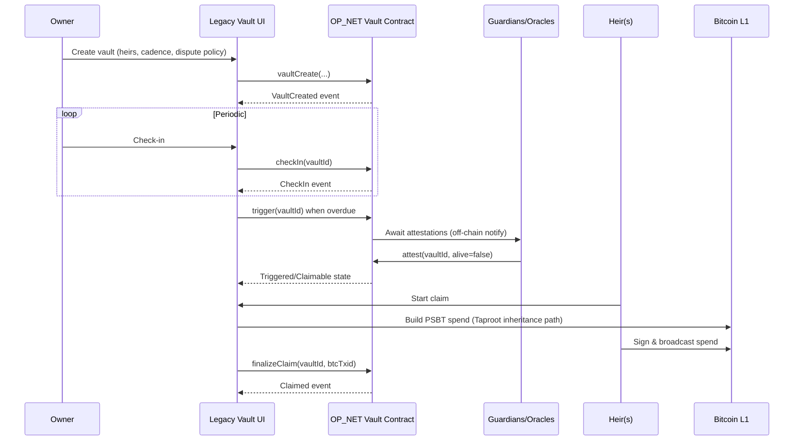
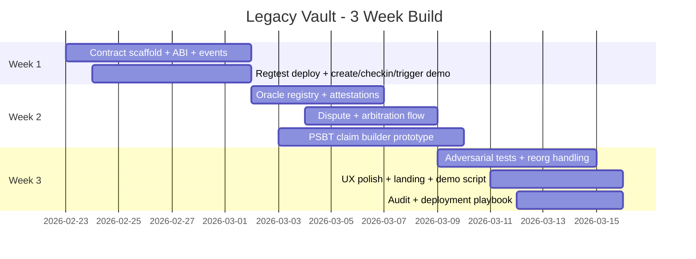

# Bitcoin Layer‑1 Crypto Inheritance Protocol on OP_NET

## Executive summary

This report specifies a complete, implementable architecture for a **Bitcoin Layer‑1 inheritance protocol** (“Deadman Wallet / Legacy Vault”) built as an OP_NET dApp, with two custody modes and a shared policy+oracle layer.

The central design constraint is that OP_NET smart contracts run using Bitcoin transactions plus OP_NET nodes executing deterministic WebAssembly, with contract bytecode deployed in a **P2OP** output and contract state changes committed back to Bitcoin. OP_NET’s docs describe P2OP as a SegWit v16 address type treated by Bitcoin as **“anyone‑can‑spend”** while OP_NET’s off‑chain logic enforces access control. citeturn33view0 This creates a crucial custody implication: if you place meaningful BTC value directly into P2OP outputs, Bitcoin consensus itself does not enforce ownership conditions—so the protocol must either (a) custody BTC in standard Bitcoin script outputs (Taproot/CLTV/CSV), or (b) treat P2OP UTXOs as state containers and keep “value” primarily in OP_NET state and/or minimal BTC amounts. citeturn33view0

Accordingly, the recommended product is a **hybrid**:

- **Policy & adjudication layer on OP_NET**: vault registration, check‑in cadence, heirs/guardians, oracle attestations, dispute windows, and on‑chain event logs. OP_NET provides EVM‑like contract function calls, logs, and persistent storage, tailored to its UTXO model. citeturn5view0turn30view0turn33view0  
- **BTC custody on Bitcoin L1 using Taproot scripts** (preferred “secure custody” mode): the actual inheritance UTXO is a Taproot output whose script path(s) enforce timelocks and heir authorization using consensus‑enforced opcodes such as CLTV and CSV. citeturn35view2turn35view3turn35view6  
- **Optional OP_NET‑managed custody mode** (“fast MVP mode” for hackathon): funds are deposited into an OP_NET‑tracked vault address with explicit user disclosure that Bitcoin treats P2OP as anyone‑can‑spend; this mode is suitable for small balances, demo tokens, or testnet incentives, but is not the recommended “serious BTC inheritance” path. citeturn33view0

A three‑week competition plan is included with week‑by‑week milestones, test priorities, and a constrained MVP scope that still demonstrates end‑to‑end inheritance with auditable on‑chain state transitions on OP_NET test networks (testnet/regtest), noting OP_NET docs list mainnet as **disabled** as of their latest update. citeturn31view3

Finally, this report includes: personas, stories, UX flows, a full data model, on‑chain schema options (UTXO‑only vs inscription vs off‑chain anchoring), security and privacy models, oracle and incentive design, Bob (OPNet AI Instructor) integration approach, API specifications, sample transaction sequences, and a one‑page landing page with suggested visual assets.

## Bitcoin + OP_NET constraints and design options

OP_NET positions itself as a system that brings contracts/tokens/NFTs to Bitcoin “using only Bitcoin’s existing rules,” deploying WebAssembly bytecode into a **P2OP output** and executing contract calls deterministically off‑chain via `opnet-node`, then committing results back to Bitcoin as standard transactions. citeturn33view0turn33view4 OP_NET contracts can hold persistent storage and emit logs similarly to Ethereum, but operate on a UTXO model and use a gas system that is denominated in satoshis. citeturn5view0turn31view4

### Core OP_NET mechanics relevant to inheritance

- **Unified Accounts**: OP_NET treats a public key as a single account identity across legacy/SegWit/Taproot address formats, applying Taproot‑style tweaks and enabling signature‑based flows. citeturn34view0  
- **In‑contract time/identity**: the OP_NET runtime exposes properties like `Blockchain.tx.origin`, `Blockchain.tx.sender`, block number, and median timestamp, enabling timelock‑like contract logic (distinct from Bitcoin script timelocks). citeturn33view2  
- **On‑chain transaction lifecycle**: deployment and interactions are built via provider simulations (returning gas estimates and `estimatedSatGas`), then broadcast via Node.js `sendTransaction` or via WalletConnect flows in browsers. citeturn7view0turn7view1turn8view5  
- **Fees**: OP_NET transactions pay a gas fee plus optional priority fee; docs state fees are burned to dead contract addresses (not redistributed). citeturn31view4  
- **Networks**: OP_NET docs list mainnet as disabled (while testnet/regtest are active). citeturn31view3  
- **Receipts & proofs**: `getTransactionReceipt` returns `receiptProofs`, events, and revert data—useful for auditability and potential fraud‑proof UX. citeturn11view0

### Bitcoin Layer‑1 primitives needed for inheritance

A Bitcoin inheritance vault can be enforced at consensus using timelocks and Taproot scripts:

- **Absolute timelocks** via `OP_CHECKLOCKTIMEVERIFY` (CLTV) allow outputs to be unspendable until a specified block height or time. citeturn35view2  
- **Relative timelocks** via `OP_CHECKSEQUENCEVERIFY` (CSV, together with BIP68 semantics) restrict spending based on the age of the UTXO. citeturn35view3  
- **Taproot** (SegWit v1) provides key‑path and script‑path spending with MAST‑style privacy, which is ideal for “owner path vs heir path vs recovery path” policies where only the exercised branch is revealed. citeturn35view6  
- **Schnorr signatures** (Taproot ecosystem) are the signature system used in Taproot. citeturn29search0  
- **PSBT** (Partially Signed Bitcoin Transactions) provides offline, multi‑party signing workflows and is standard for multi‑sig and hardware‑wallet interoperability. citeturn35view4  
- **MuSig2** is a deployed standard for Schnorr‑compatible aggregated multisignatures, improving privacy and on‑chain efficiency for multi‑signer key‑path control. citeturn35view5  
- **Miniscript** (BIP379, draft) is useful for constructing analyzable Bitcoin spending policies, especially for complex dispute/recovery trees (not required, but strongly recommended for correctness). citeturn35view7

### Design options comparison table

| Option | On-chain footprint | Custody security (BTC) | UX complexity | OP_NET benefit | Primary failure modes | Best for |
|---|---|---|---|---|---|---|
| UTXO-only Taproot vault (CLTV/CSV) | Moderate (one UTXO + updates) | Strong (Bitcoin consensus enforced) citeturn35view2turn35view3turn35view6 | Medium (needs PSBT tooling) citeturn35view4 | OP_NET used as registry/oracles only | Lost keys, poor backup, griefing via disputes | Real BTC inheritance |
| OP_NET-only custody (P2OP) | Low/medium (contract state in P2OP) | Weaker for “real BTC” because P2OP described as anyone-can-spend at Bitcoin level citeturn33view0 | Low (pure contract calls) citeturn5view0 | Maximum OP_NET integration | Bitcoin-level spend theft risk; reliance on OP_NET enforcement semantics | Hackathon MVP, tokenized demos |
| “Inscription”-style documents + off-chain enforcement | High (data on-chain) | Depends on separate custody | Medium | Minimal | Document leakage, indexing variability | Proof-of-will anchoring only |
| Off-chain storage with on-chain hash anchor | Very low | Strong if paired with UTXO custody | Medium | Moderate | Availability of off-chain storage | Private wills + strong custody |

**Recommended default**: **UTXO-only Taproot custody + OP_NET policy/oracle/dispute registry**, with a clear user‑visible toggle to enable “OP_NET‑only custody” for small demos/testnet. This aligns with Bitcoin’s consensus‑enforced safety while leveraging OP_NET’s contract runtime, storage classes, logs, and account abstraction for the policy layer. citeturn33view0turn30view0turn34view0

## Product overview, personas, user stories, and UX flows

### Product overview

**Legacy Vault** helps a Bitcoin holder:

- Define heirs and allocations.
- Configure a check‑in cadence (heartbeat).
- Optionally designate guardians/oracles and arbitrators.
- Ensure that if the owner stops checking in, the vault transitions through a **trigger → challenge/dispute window → claim** lifecycle with tamper‑evident on‑chain logs.

The product is conceptually split into three layers:

1. **Vault Policy Contract (OP_NET)**: a registry of vault policies and state machine transitions (Active → Triggered → Claimable → Claimed; plus Disputed paths). The contract also stores encrypted metadata pointers (hashes, URIs) and emits events for off‑chain monitoring. citeturn5view0turn30view0turn33view0  
2. **Custody Layer** (Bitcoin L1 Taproot vault): a Taproot output that enforces the inheritance conditions (heir spend after timelock, owner anytime, optional recovery/arbitrator path). citeturn35view2turn35view3turn35view6  
3. **Client + Services**: wallet UX (OP_WALLET via WalletConnect), notifications, optional watchtowers, and evidence storage (encrypted will docs). WalletConnect integration is explicitly documented for OP_NET, including OP_WALLET support patterns. citeturn7view4turn8view3turn8view5

### Personas

**Vault Creator (Owner)**  
A self-custody Bitcoin holder who wants a deadman switch with minimal trust and minimal ongoing maintenance. They value safety, a clear “cancel/override” path, and secure backups.

**Heir (Recipient)**  
Often non-technical. Needs a guided claim process, clear status visibility, and safe key onboarding. They may not have an on-chain history yet (fresh wallet). OP_NET notes fresh wallets must reveal public keys via a transaction before they can be used in some flows. citeturn34view0

**Guardian / Oracle Operator**  
May be a family attorney, friend, or a specialized service. Provides attestations (e.g., “owner likely deceased” or “owner contacted me recently”), participates in disputes, and is incentivized to act honestly.

**Arbitrator**  
A dispute resolver (could be a DAO committee, a professional arbitrator group, or a multisig of known entities). Needs an on-chain workflow for dispute decisions, with a predictable window and clear authority limits.

### User stories

Owner stories:
- Create a vault with heirs and weights and choose between “Bitcoin script custody” and “OP_NET custody.”
- Set check-in schedule and notification channels; perform a check‑in.
- Add or remove heirs, rotate keys, and change thresholds with a safety delay.
- Trigger emergency recovery if keys are compromised.

Heir stories:
- Receive an invite link, set up wallet, verify identity (optional), and see claim status.
- Submit a claim request when vault is triggerable/claimable.
- If a dispute occurs, submit counter‑evidence and wait for resolution.

Oracle / arbitrator stories:
- Stake/register, submit attestations, respond to disputes, and get paid or slashed depending on resolution.

### UX flows (end-to-end)

The flows below assume the recommended default: **Taproot custody + OP_NET policy registry**. When “OP_NET-only custody” is enabled, steps involving the Taproot vault UTXO are replaced by a “deposit to vault contract address” step.

**Onboarding**
1. Connect wallet (OP_WALLET via WalletConnect). citeturn7view4turn8view3  
2. “Reveal” account if needed: OP_NET unified accounts may require public key availability; the UI warns if the wallet has not made any transaction and instructs a small, harmless on-chain reveal step if required. citeturn34view0  
3. Create profile: notification settings, optional recovery contact.

**Create vault**
1. Choose custody mode:
   - **Secure custody** (Taproot timelock vault) recommended.
   - **OP_NET custody** (demo/testnet). P2OP is described as anyone-can-spend at Bitcoin level; UI must display a prominent warning. citeturn33view0  
2. Define heirs (addresses or invite links) and allocation policy (weights or fixed shares).
3. Choose heartbeat parameters: interval (e.g., 30/90/180 days), grace period, and trigger threshold.
4. Configure dispute model: challenge window, arbitrators, required oracle quorum.
5. Review: show “what happens if you disappear” simulation (dates, blocks, fees).
6. Confirm: write vault policy to OP_NET contract and emit `VaultCreated` event. citeturn5view0turn30view0

**Check-ins**
- Owner presses “Check in” (or signs a message and submits). The OP_NET contract records `last_alive_timestamp = Blockchain.block.medianTimestamp` and emits `CheckIn(owner, vaultId, ts)`. Runtime includes block timestamp. citeturn33view2  
- In secure custody mode, check-ins do **not** have to roll the Taproot UTXO on each check‑in; instead, check‑ins update the OP_NET policy state, while the Taproot custody branch uses a conservative long timelock with an OP_NET‑coordinated “claim authorization” (described in the next section). This reduces on-chain custody churn but adds reliance on OP_NET policy for *when* heirs are allowed to attempt a spend.

**Inheritance triggers**
1. When `now > last_alive + interval + grace`, anyone can call `trigger(vaultId)`; contract transitions to TRIGGERED and starts a challenge timer. Block timestamps are available in runtime. citeturn33view2  
2. Oracles/guardians can submit attestations during this period.  
3. Owner can “veto” during challenge by checking in again.

**Claim process**
1. After challenge window ends and oracle quorum is met (or if quorum is configured as “optional”), vault becomes CLAIMABLE.  
2. Heirs initiate claim. The UI generates a PSBT spending from the Taproot inheritance UTXO and collects heir signatures. PSBT is the standard format for offline/multi-party signing. citeturn35view4  
3. The app optionally requests an OP_NET “Claim Authorization” event proof to include as metadata (off-chain) for auditability. Transaction receipts include events and proofs retrievable via OP_NET provider. citeturn11view0  
4. Broadcast final Bitcoin transaction through the user’s wallet flow, and separately finalize OP_NET state to “Claimed” with a reference to the Bitcoin txid.

**Dispute / arbitration**
- During TRIGGERED or CLAIMABLE, authorized disputers (guardians, arbitrators, or owner) can file `dispute(vaultId, reasonHash)`; vault state becomes DISPUTED and claim is paused.  
- Arbitrator submits `resolveDispute(vaultId, outcome)` within a window; outcome either returns vault to ACTIVE or finalizes CLAIMABLE.

**Recovery**
- Owner recovery flows vary by configuration:
  - Key rotation requires a time-delayed “policy update” (to protect heirs from sudden malicious changes).
  - If owner reports compromise, they can freeze the vault immediately and require arbitration to unfreeze.

Mermaid sequence overview:



## Architecture, data model, and on-chain schema

### High-level architecture

```mermaid
flowchart LR
  subgraph Client
    UI[Web/mobile dApp UI]
    WC[WalletConnect + OP_WALLET]
  end

  subgraph OPNet
    RPC[OP_NET JSONRpcProvider]
    VC[Vault Policy Contract (Wasm)]
    EVT[Events/Receipts + Proofs]
  end

  subgraph BitcoinL1
    UTXO[Taproot Vault UTXO]
    TX[Spends/Claims Tx]
  end

  subgraph Services
    N[Notifier + Scheduler]
    W[Watchtower/Monitor]
    DS[Encrypted Document Store]
  end

  UI-->WC
  UI-->RPC
  RPC-->VC
  VC-->EVT
  UI-->DS
  N-->UI
  W-->EVT
  UI<-->UTXO
  TX-->UTXO
```

This design uses OP_NET’s provider model (`JSONRpcProvider`) for querying and broadcasting transactions. citeturn7view5 In production, the UI should support both:
- direct provider calls (Node.js backend) where `sendTransaction` is available, citeturn7view1 and  
- browser WalletConnect flows for signing and sending. citeturn8view5

### OP_NET on-chain storage model for the Vault Policy Contract

OP_NET provides multiple storage classes for efficiency (e.g., `StoredU256`, `StoredBoolean`, `StoredString`, address maps, serializable KV structures). citeturn33view3 The contract runtime provides `Blockchain.nextPointer` for dynamic storage pointer management. citeturn33view2

**Core records (proposed)**

- `Vault`  
  - `vaultId: u256` (hash of (owner_pubkey || nonce))  
  - `owner: Address` (`Blockchain.tx.origin` at creation) citeturn33view2  
  - `status: u8` enum {ACTIVE, TRIGGERED, CLAIMABLE, DISPUTED, CLAIMED, FROZEN}  
  - `createdAtTs: u64` (block median timestamp) citeturn33view2  
  - `lastCheckInTs: u64`  
  - `checkInIntervalSec: u64`  
  - `graceSec: u64`  
  - `challengeSec: u64`  
  - `heirPolicyHash: bytes32` (hash of heir set + weights + optional identity commitments)  
  - `btcCustodyDescriptorHash: bytes32` (hash of the Taproot policy descriptor / miniscript policy)  
  - `docCommitmentHash: bytes32` (commitment to encrypted will package)  
  - `oracleQuorum: u8`, `oracleSetHash: bytes32`  
  - `arbitratorSetHash: bytes32`  
  - `finalBtcTxId: bytes32?` (once claimed)

- `HeirIndex` (optional for on-chain readability)  
  Because arrays are noted as potentially suboptimal, prefer compact maps. citeturn33view3  
  - `heirAddr -> weight` via `AddressMemoryMap<u256>` citeturn30view0

- `OracleRegistry`  
  - `oracleAddr -> stakeAmount`  
  - `oracleAddr -> status flags`  
  If you tokenize stake with OP_20, you can use OP_20 approvals and transfers with standard methods. citeturn33view5

- `Attestations`  
  - `(vaultId, epoch) -> bitmap` // which oracles have attested  
  - `(vaultId, epoch) -> attestationScore` // sum of weighted stake or trust points  
  - `epoch` here is internal to contract (not OP_NET epochs); do not confuse with OP_NET node epoch finality.

### Custody layer: Taproot inheritance vault descriptor

A robust BTC inheritance output should be a Taproot output with multiple spending paths:

- **Owner path**: spend anytime with owner key (key path, optionally MuSig2 co-signer if owner wants 2FA). MuSig2 improves privacy and reduces signatures on chain. citeturn35view5  
- **Heir path**: after a relative timelock (CSV) or absolute timelock (CLTV), allow heirs to spend with threshold policy. citeturn35view2turn35view3  
- **Recovery/arbitration path**: after a longer timelock, allow arbitration multisig or a “break glass” key.

A high-level miniscript-like policy (conceptual, not exact syntax):

- `or( pk(owner), and( older(INHERIT_DELAY), thresh(k, pk(heir1), pk(heir2), ...)), and( older(RECOVERY_DELAY), thresh(m, pk(arbitrator1), pk(arbitrator2), ...)) )`

Time primitives are from BIP65 (CLTV) and BIP112 (CSV). citeturn35view2turn35view3 Taproot provides the structure for hiding unused branches. citeturn35view6

### PSBT workflow for building the inheritance claim

PSBT (BIP174) is the correct interoperability mechanism for heir threshold signing, hardware wallets, and offline workflows. citeturn35view4 The protocol’s claim UX should always produce a PSBT first, then finalize.

**Proposed PSBT sequence**
1. UI fetches UTXO(s) locked by the vault descriptor.
2. UI constructs an unsigned transaction spending the vault UTXO to heir destination(s) (either one transaction with multiple outputs, or separate transactions if heirs coordinate poorly).
3. UI encodes it as PSBT and attaches Taproot leaf/script path data required for signing.
4. Each heir signs the PSBT.
5. Once threshold signatures are collected, finalize and extract raw transaction; broadcast.
6. OP_NET contract records `finalizeClaim(vaultId, btcTxid)` for auditability and UI state.

### Fee considerations on OP_NET

OP_NET requires gas simulation and suggests buffering estimated gas by 15% due to fluctuation; simulations produce `estimatedGas` and `estimatedSatGas`. citeturn7view0 OP_NET nodes provide `gasParameters()` returning base gas, gas per satoshi, and recommended Bitcoin fee rates (low/medium/high) used in deployment/interactions. citeturn10view0turn10view1 OP_NET docs describe a separate gas fee and optional priority fee and state that both are burned. citeturn31view4

### Sample transaction sequences

**Sequence A: Deploy vault contract on OP_NET (developer/admin action)**
- Use `TransactionFactory.signDeployment` with `IDeploymentParameters` including UTXOs, bytecode, `feeRate`, `challenge`, and `priorityFee`, then broadcast via `sendRawTransactions`. citeturn7view2

**Sequence B: Create vault (user action)**
- Simulate `vaultCreate(...)` to estimate gas and returned values; then send via WalletConnect or Node.js `sendTransaction`. citeturn7view0turn7view1turn8view5

**Sequence C: Check-in**
- Call `checkIn(vaultId)`; contract reads `Blockchain.tx.origin` and `Blockchain.block.medianTimestamp` and updates `lastCheckInTs`. citeturn33view2turn34view0

**Sequence D: Trigger**
- Any user calls `trigger(vaultId)` after policy permits; vault becomes TRIGGERED and starts challenge window based on block median timestamp. citeturn33view2

**Sequence E: Claim**
- Heir reads claimability via provider `call` or contract getter (no broadcast) using `provider.call(...)` patterns. citeturn12view1  
- Build Bitcoin PSBT claim transaction; collect signatures; broadcast. citeturn35view4  
- Finalize OP_NET contract state with `finalizeClaim(vaultId, btcTxid)`, and retrieve receipt + proofs for the UI. citeturn11view0

## Security, privacy, oracle, and incentives specification

### Threat model

**Key threats**
- Owner key compromise (attacker triggers or changes heirs).
- Heir key compromise (attacker claims funds after trigger).
- False death claims (oracles collude or adversary spams attestations).
- Denial-of-service: griefing disputes to stall claims.
- OP_NET-specific: if custody uses P2OP directly, Bitcoin-level “anyone-can-spend” semantics are a critical risk. citeturn33view0  
- Chain reorganizations affecting “finality” perception; OP_NET provider includes a method to query reorgs. citeturn14view1

### Security controls and mitigations table

| Threat | Mitigation | Layer |
|---|---|---|
| Owner key theft | Time-delayed policy updates; optional 2-of-2 “owner+device” key path; emergency freeze requiring arbitrator set | Bitcoin custody + OP_NET contract |
| Heir key theft post-trigger | Require threshold k-of-n heirs; optional “proof of life/dispute window”; allow arbitrator override | Bitcoin custody policy + OP_NET dispute |
| Oracle collusion | Multi-oracle quorum; stake-weighted attestations; slashing for provable fraud; diversify oracle set | OP_NET |
| Griefing via repeated disputes | Dispute staking and slashing; limited dispute frequency; bounded arbitration windows | OP_NET |
| Replay / signature misuse | Domain-separated signing messages; include `vaultId`, chain/network, and expiry in signed payloads; use Schnorr verification in contract where available | OP_NET + Bitcoin signing |
| Reorg confusion | Require confirmations before state transitions; show reorg alerts; use provider reorg queries in monitoring | OP_NET infra + UI |
| P2OP custody theft | Do not store significant BTC value in P2OP outputs in secure mode; treat P2OP as state container only; disclose risk in “OP_NET custody” mode | Architecture decision |

### Key management recommendations

- **Owner**: hardware wallet + backups; if using multi-device, prefer MuSig2 for privacy/efficiency. citeturn35view5  
- **Heirs**: guided onboarding with wallet setup; if fresh wallet public key is needed (Unified Accounts note), prompt a minimal reveal transaction once, then proceed. citeturn34view0  
- **Arbitrators**: quorum multisig with independent operators.

### Timelocks and dispute windows

- Use Bitcoin script timelocks for irrevocable custody enforcement: CLTV/CSV. citeturn35view2turn35view3  
- Use OP_NET contract time windows for *process* state (trigger/challenge/dispute), based on `Blockchain.block.medianTimestamp`. citeturn33view2

A robust policy uses **two layers of delay**:
1. **Process delay** (OP_NET): trigger + challenge window, allowing veto/dispute.
2. **Custody delay** (Bitcoin): CSV/CLTV ensures heirs can only spend after a conservative delay, which should be ≥ (trigger + challenge + expected oracle time) to avoid race conditions.

### Oracle design

**Principle**: the oracle should minimize reliance on subjective “death” facts; instead, it should attest to observable signals (“lack of check-in,” “out-of-band evidence hash exists,” “guardian confirmation”).

**Oracle scheme**
- Oracles register in OP_NET contract and may be required to stake (in BTC or OP_20 token). OP_20 provides ERC‑20-like allowance/transfer patterns if used. citeturn33view5  
- Each oracle submits `attest(vaultId, epoch, verdict, evidenceHash)` in a bounded window.
- Contract computes `attestationScore = Σ (stakeWeight_i * verdict_i)` and compares to quorum threshold.
- **Sybil resistance**: stake-based entry plus optional “fidelity bond”-style time-locked stake can be added in the roadmap (leveraging timelocks per CLTV). citeturn35view2

### Incentive and economic model

Because OP_NET fees are burned (per docs), the protocol cannot rely on “fee redistribution” from OP_NET gas. citeturn31view4 Therefore, incentives must be explicit:

- **Vault creation fee**: a protocol fee paid to a protocol-controlled Bitcoin address (in secure-custody mode) or tracked as an OP_20 payment.  
- **Oracle staking & slashing**: stakes locked in OP_NET state; slashing triggered when an attestation is proven wrong by arbitration outcome.
- **Arbitration fees**: paid by the disputing party (or from a “vault maintenance fund” deposited by the owner).
- **Watchtower rewards**: optional. Watchtowers get paid for broadcasting claim transactions or for alerting owner during trigger.

### Privacy considerations

- **Metadata minimization**: store only hashes/commitments on OP_NET; do not store plaintext heirs, legal names, or documents on-chain.  
- **Encryption**: encrypt will packets client-side; store ciphertext off-chain; commit a hash on OP_NET.  
- **Selective disclosure**: heirs receive decryption keys via secret sharing or sealed envelope process; the contract only sees hashes.

OP_NET storage supports strings and serializable chunked structures, but longer data increases gas/storage overhead; best practice is to use compact storage for fees. citeturn33view3turn31view4

## Implementation plan: OP_NET integration, APIs, testing, deployment, monitoring, legal

### Bob + AI integration strategy

entity["organization","OP_NET","bitcoin metaprotocol"] provides **Bob** as an “AI Instructor” exposed as an **MCP server** (`https://ai.opnet.org/mcp`) with “28+ tools” and “no API key needed,” intended to be connected from agent environments (Claude/Cursor/Windsurf/MCP clients). citeturn15view0

Two distinct integrations are recommended:

1. **Developer acceleration (competition-critical)**: use Bob during development to scaffold contracts, generate tests, run audits, and produce deployment configs. The Bob page explicitly positions it as an MCP server that “knows everything about building on Bitcoin L1 with OPNet.” citeturn15view0  
2. **User-facing AI features (product)**: implement an in-app AI assistant (separate from Bob) for:
   - “Explain my vault settings” summaries
   - Natural-language will drafting (stored encrypted; only hashes on-chain)
   - Heir onboarding conversations and checklists
   - Risk warnings and periodic reminders

### API specifications (application backend)

Even if the dApp is fully client-side, a minimal backend improves reliability for notifications, document storage, and monitoring. Below is a concrete REST API spec.

**Authentication**
- Wallet-based session: SIWB-like signing (“Sign-In With Bitcoin”) can be implemented using Schnorr signatures (Taproot) and/or OP_NET’s signature verification patterns. OP_NET unified accounts support Schnorr signature verification inside contracts via `Blockchain.verifySchnorrSignature`. citeturn34view0

**Endpoints**

`POST /v1/auth/challenge`  
Request:
```json
{
  "address": "op1... or btc address",
  "network": "opnet-testnet",
  "purpose": "login"
}
```
Response:
```json
{
  "challenge": "base64(nonce||timestamp||domain)",
  "expiresAt": 1730000000
}
```

`POST /v1/auth/verify`  
Request:
```json
{
  "address": "op1...",
  "signature": "hex_or_base64",
  "challenge": "base64(...)"
}
```
Response:
```json
{
  "token": "jwt_or_paseto",
  "expiresAt": 1730003600
}
```

`POST /v1/vaults`  
Creates an off-chain vault draft and returns computed hashes to be written on OP_NET.
```json
{
  "custodyMode": "taproot-utxo",
  "heirs": [
    {"address": "bc1p...", "weight": 50},
    {"address": "bc1p...", "weight": 50}
  ],
  "schedule": {"intervalSec": 7776000, "graceSec": 1209600, "challengeSec": 1209600},
  "arbitration": {"arbitratorKeys": ["..."], "threshold": 2},
  "documents": {"encryptedBundleCid": "ipfs://...", "bundleHash": "0x..."}
}
```
Response:
```json
{
  "vaultDraftId": "uuid",
  "heirPolicyHash": "0x...",
  "btcDescriptorHash": "0x...",
  "docCommitmentHash": "0x..."
}
```

`GET /v1/vaults/{vaultId}`  
Response:
```json
{
  "vaultId": "0x...",
  "status": "ACTIVE",
  "lastCheckInTs": 1730000000,
  "nextDueTs": 1737776000,
  "opnetContract": "op1...",
  "btcUtxo": {"txid": "...", "vout": 0, "valueSat": 123456789},
  "dispute": null
}
```

`POST /v1/vaults/{vaultId}/notify/test`  
Triggers a notification test (email/SMS/push).

`POST /v1/claims/{vaultId}/psbt`  
Builds a claim PSBT template (backend-assisted coin selection).
Request:
```json
{
  "destinationOutputs": [{"address":"bc1p...","valueSat": 120000000}],
  "feeRateSatVb": 10
}
```
Response:
```json
{
  "psbtBase64": "cHNidP8BA...",
  "expiresAt": 1730003600,
  "requiredSigners": 2,
  "signingInstructions": {
    "taprootLeaf": "hex",
    "sighashType": "DEFAULT"
  }
}
```

`POST /v1/claims/{vaultId}/submit-proof`  
Stores evidence (encrypted) and returns hash for on-chain dispute submission.

### OP_NET contract interface (ABI-level spec)

OP_NET contract interactions use ABIs to describe functions and events. citeturn6view0 The dApp should ship a JSON ABI for the vault contract plus OP_NET ABI extensions.

**Events**
- `VaultCreated(owner, vaultId, heirPolicyHash, btcDescriptorHash, docHash)`
- `CheckIn(owner, vaultId, ts)`
- `Triggered(vaultId, ts)`
- `Attested(vaultId, oracle, verdict, evidenceHash)`
- `Disputed(vaultId, disputer, reasonHash)`
- `Resolved(vaultId, outcome)`
- `ClaimFinalized(vaultId, btcTxid)`

**Functions**
- `vaultCreate(heirPolicyHash, btcDescriptorHash, docHash, scheduleParams, oracleParams, arbitrationParams) -> vaultId`
- `checkIn(vaultId)`
- `trigger(vaultId)`
- `attest(vaultId, verdict, evidenceHash)`
- `dispute(vaultId, reasonHash)`
- `resolveDispute(vaultId, outcome)`
- `finalizeClaim(vaultId, btcTxid)`
- `getVault(vaultId) -> VaultView`

**Signature-based methods**
Where appropriate, allow meta-transactions:
- `checkInWithSig(vaultId, sig, message)` verified via `Blockchain.verifySchnorrSignature`. citeturn34view0

### OP_NET node/provider integration details

- Use `JSONRpcProvider(url, network)` to talk to OP_NET RPC endpoints. citeturn7view5  
- Always simulate before broadcasting; simulations return `estimatedGas` and `estimatedSatGas`, and OP_NET docs recommend a 15% buffer. citeturn7view0  
- In Node.js, `sendTransaction` is available for sending simulated transactions. citeturn7view1  
- In browser environments, use WalletConnect setup and OP_WALLET flows. citeturn7view4turn8view3turn8view5  
- Use `getTransactionReceipt` to fetch events and `receiptProofs` for auditability. citeturn11view0  
- Use `getReorg` in monitoring to detect reorgs and revalidate state transitions. citeturn14view1

### Testing plan

OP_NET provides a dedicated unit test framework for smart contracts. citeturn9view0 The test plan should include:

- **Contract unit tests**
  - Vault lifecycle state machine
  - Boundary conditions for timestamps and windows using `Blockchain.block.medianTimestamp` citeturn33view2
  - Storage integrity (no array-heavy patterns; prefer storage classes) citeturn33view3
  - Signature verification tests for `checkInWithSig` using contract signature verification patterns citeturn34view0

- **Integration tests**
  - WalletConnect signing + transaction submission flows citeturn8view5  
  - Provider simulations and fee buffering citeturn7view0turn10view1
  - Receipt parsing (events and receiptProofs) citeturn11view0

- **Bitcoin custody simulation**
  - PSBT creation/signing/finalization workflows consistent with BIP174. citeturn35view4  
  - Timelock correctness for CLTV/CSV policies (unit tests for script satisfaction, plus regtest validation). citeturn35view2turn35view3

- **Adversarial tests**
  - Oracle spam + dispute griefing scenarios
  - Attempted replay of signatures
  - Reorg simulation + delayed confirmations (using OP_NET reorg query in UI/monitoring). citeturn14view1

### Deployment plan

Because OP_NET docs list mainnet disabled, the deployment plan must be staged on regtest/testnet first. citeturn31view3

- **Staging (regtest)**: use `https://regtest.opnet.org` endpoints and automated local testing; regtest supports rapid iteration and frequent breaking changes per docs. citeturn31view3turn7view2  
- **Public testing (testnet)**: deploy contract and UI; run incentives and oracle simulations.
- **Mainnet readiness**: once OP_NET mainnet becomes active, redeploy contract, run audits, and require extra confirmations for all irreversible transitions.

### Monitoring and observability

- Index contract events via receipts (`events`) and store in an append-only database for UI queries. citeturn11view0  
- Track OP_NET fee rates via `gasParameters()` (base gas, recommended Bitcoin fee rates) and alert if fees spike. citeturn10view0turn10view1  
- Monitor reorgs and show user alerts if a vault state transition might be affected. citeturn14view1  
- For custody UTXOs, monitor mempool and confirmations; apply conservative confirmation thresholds before declaring “claim completed.”

### Legal and compliance considerations

This protocol is **not a substitute for a legal will**. In many jurisdictions, digital assets may still require probate, executor authority, or specific testamentary formalities. The product must:
- Provide explicit disclaimers that on-chain instructions may conflict with legal outcomes.
- Allow optional KYC/identity verification for heirs and arbitrators (configurable, off by default).
- Provide a “legal export” package: a human-readable summary of vault settings and a signed attestation from the owner (stored off-chain encrypted) that can be provided to courts if needed.

Because jurisdiction is unspecified, the app should support configurable templates and a region-neutral baseline, with a roadmap for jurisdiction-specific modules.

## Milestones, developer checklist, and launch assets

### Three-week competition milestone schedule

| Week | Deliverable | Acceptance criteria |
|---|---|---|
| Week 1 | Contract MVP + UI skeleton | Deploy Vault Policy Contract on regtest; create vault; check-in; trigger state; event logs visible via receipts citeturn7view2turn11view0 |
| Week 2 | Oracles + disputes + claim UX | Oracle registry + attestations; dispute/resolve flows; PSBT claim builder prototype; end-to-end testnet demo citeturn35view4turn8view5 |
| Week 3 | Hardening + docs + “demo day” polish | Attack scenario tests; monitoring dashboard; landing page; Bob-assisted audit pass; clear custody-mode disclosure citeturn15view0turn33view0 |

Mermaid timeline (competition):



### Longer-term roadmap

- Multi-vault portfolios, institution/executor mode
- Formal “fidelity bond” oracle admission using timelocks (CLTV-based) citeturn35view2  
- MuSig2-based owner multi-device security defaults citeturn35view5  
- Jurisdictional templates and lawyer/executor integrations
- Optional hardware key ceremonies and structured backup packets

### Developer checklist

- OP_NET essentials
  - Use `JSONRpcProvider` and correct network configuration citeturn7view5turn31view3
  - Implement simulate→buffer→broadcast loop citeturn7view0turn10view1
  - Emit thorough events; build receipt-driven UI indexing citeturn11view0
  - Avoid storage-heavy arrays; use provided storage classes/maps citeturn33view3
  - Provide WalletConnect integration for browser users citeturn8view3turn8view5

- Bitcoin custody essentials
  - Use CLTV/CSV correctly; test both height and time variants as applicable citeturn35view2turn35view3
  - Implement PSBT flows for heir threshold signing citeturn35view4
  - Make Taproot branches minimal and auditable; disclose policy clearly citeturn35view6

- UX & safety essentials
  - Prominent warnings for OP_NET-only custody and P2OP semantics citeturn33view0
  - Recovery/freeze controls and explicit dispute status in UI
  - Plain-language “what happens next” timelines for heirs

### UX copy snippets

**Create Vault – custody selection**
- “Secure custody (recommended): Your BTC is locked in a Bitcoin Taproot vault with timelocks. OP_NET stores your inheritance policy and triggers.”
- “OP_NET custody (demo): Faster setup, but Bitcoin treats P2OP outputs as anyone‑can‑spend. Use only for testnet or small demos.” citeturn33view0

**Trigger screen**
- “This vault is overdue. It will become claimable after the challenge window ends unless the owner checks in.”

**Heir claim screen**
- “You’re about to generate a claim transaction. You may need signatures from other heirs to reach the required threshold.”

### One-page landing page copy

**Headline**  
Legacy Vault: Bitcoin inheritance without bridges.

**Subhead**  
A Layer‑1 deadman wallet built on OP_NET for policy automation and auditable triggers—paired with Taproot timelock custody for serious BTC.

**Key features**
- Bitcoin-native inheritance vaults with timelocks (CLTV/CSV) citeturn35view2turn35view3  
- OP_NET policy registry with on-chain events and receipt proofs citeturn11view0turn33view0  
- Optional guardian/oracle attestations with dispute/arbitration flows  
- Heir onboarding with PSBT-based multi-party signing citeturn35view4  
- Privacy-first document commitments (encrypted off-chain, hashed on-chain)

**How it works**
1. Create a vault: choose heirs, check‑in cadence, and dispute rules.  
2. Check in periodically: one on-chain action updates your “proof of life.” citeturn33view2  
3. If you stop: the vault triggers, enters a challenge window, then becomes claimable.  
4. Heirs claim: a PSBT guides threshold signing and broadcasts the claim transaction. citeturn35view4

**Security**
- Taproot custody enforced by Bitcoin consensus rules citeturn35view6  
- Deterministic contract logic + auditable receipts on OP_NET citeturn33view0turn11view0  
- Optional multi-oracle quorum and slashing incentives

**FAQ**
- “Is this a legal will?”  
  No. It’s a technical inheritance protocol that should be used alongside a legally valid estate plan.
- “Do I need OP_NET mainnet?”  
  Today you can deploy and test on OP_NET testnet/regtest; OP_NET docs list mainnet as disabled as of their latest update. citeturn31view3
- “Can I use this for non-BTC assets?”  
  Yes—policies can cover OP_20 tokens as well (roadmap). citeturn33view5

**Call to action**  
“Create your first Legacy Vault on OP_NET testnet.”

### Suggested visual assets

- Hero illustration: a “vault” icon split into **Bitcoin custody** + **OP_NET policy layer**
- Timeline graphic: Active → Triggered → Claimable → Claimed
- Simple diagram of Taproot branches (Owner / Heirs / Recovery)
- “Safety badge” icons: Taproot, Timelocks, PSBT, Encrypted docs
- Optional: a subtle “AI helper” icon indicating guided heir onboarding (non-custodial)

